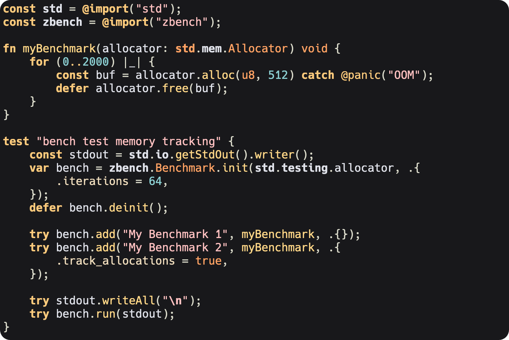

<p align="center" style="margin-bottom: 0px !important;">
  
</p>
<h1 align="center" style="margin-top: 0px;">stardust.nvim</h1>

<div align="center" >
  
[](https://github.com/hendriknielaender/stardust.nvim/blob/HEAD/LICENSE)

[](https://github.com/hendriknielaender/stardust.nvim/blob/HEAD/CONTRIBUTING.md)

</div>

## Theme



# Prerequisites

Neovim 0.8.0+

# Installing

## Using `packer`

```lua
use { "hendriknielaender/stardust.nvim" }
```

## Using `lazy.nvim`

```lua
{ "hendriknielaender/stardust.nvim", priority = 1000 , config = true, opts = ...}
```

# Basic Usage

Inside `init.vim`

```vim
set background=dark " or light if you want light mode
colorscheme stardust
```

Inside `init.lua`

```lua
vim.o.background = "dark" -- or "light" for light mode
vim.cmd([[colorscheme stardust]])
```
